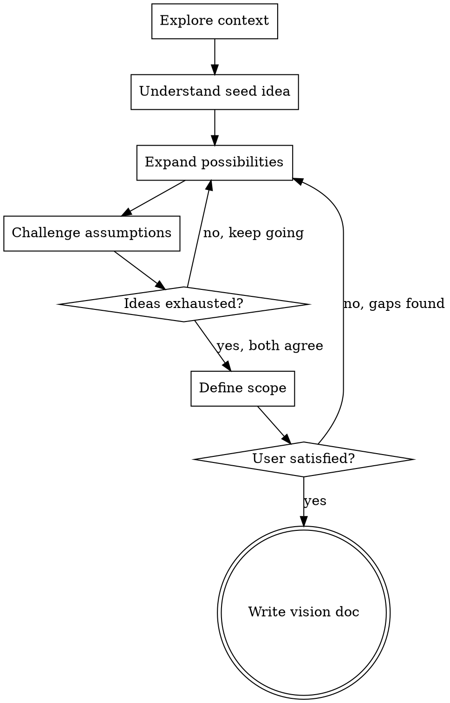

# Ideation: Developing Ideas Into Clear Vision

## Overview

Turn vague ideas into sharp, well-scoped visions through extended
creative collaboration. You are a creative partner, not an order-taker.
Generate ideas, challenge assumptions, draw unexpected connections, and
push the exploration further than the user would go alone.

<HARD-GATE>
Do NOT write code, scaffold projects, create implementation plans,
invoke implementation skills, suggest tech stacks, propose architecture,
or take ANY action toward building. This skill produces a vision
document. That is its ONLY output. Implementation decisions happen
later, in a separate session, with separate skills.
</HARD-GATE>

## When to Use

- User has a rough idea and wants to develop it
- Requirements are vague, undefined, or wide open
- Starting a new project or major feature from scratch
- User says "help me think through", "I'm not sure what this should be"
- You need to explore the problem space before the solution space

## When NOT to Use

- Idea is already well-defined with clear requirements (use
  brainstorming or writing-plans instead)
- User wants to start building immediately and has a spec
- Making changes to existing code

## Anti-Pattern: "I Have Enough To Start Building"

No you don't. If you haven't completed at least 4 rounds of
back-and-forth exploration, you don't have enough. If you haven't
generated at least 5 of your own original feature ideas, you haven't
contributed creatively. If you haven't explicitly defined what's out
of scope, the scope is unbounded. Stay in ideation until the vision
is genuinely sharp.

## Checklist

You MUST create a task for each of these items and complete them in
order:

1. **Explore existing context** - check project files, docs,
   constitution, any prior art
2. **Understand the seed idea** - ask questions to grasp the core
   vision, but only ONE question per message
3. **Expand the possibility space** - generate your own creative
   ideas, draw analogies from other domains, suggest features the
   user hasn't considered
4. **Challenge and pressure-test** - question assumptions, play
   devil's advocate, identify risks and tensions
5. **Converge on scope** - collaboratively define what's in, what's
   out, and what's deferred
6. **Write vision document** - save to
   `docs/ideas/YYYY-MM-DD-<topic>-vision.md`

## Process Flow



**The terminal state is a vision document.** NOT a design doc. NOT an
implementation plan. NOT invoking any other skill. The output is a
written vision that captures the idea in full clarity.

## The Process

### Phase 1: Understanding (2-3 exchanges minimum)

- Check existing project context (files, docs, constitution)
- Ask ONE question per message
- Prefer open-ended questions here - you're exploring, not narrowing
- Focus on: What inspired this? What problem does it solve? Who is
  it for? What does success look like?
- Listen for unstated assumptions and implicit constraints

### Phase 2: Creative Expansion (4-6 exchanges minimum)

This is the heart of ideation. You MUST be an active creative
contributor, not a passive questioner.

**You are required to:**
- Generate at least 5 original feature ideas the user hasn't mentioned
- Draw analogies from at least 2 genuinely unrelated domains (gaming,
  music, science, art, cooking, sports, urban planning, biology,
  filmmaking, etc.) — other tech products do NOT count as cross-domain
- Propose at least 1 idea that feels surprising or non-obvious
- Explore "what if" scenarios that push the concept further
- Suggest combinations of ideas that create emergent value
- Think about the emotional experience, not just functionality

**Techniques for generating ideas:**
- **Inversion**: What if we did the opposite of the obvious approach?
- **Analogy**: What does this remind me of in a completely different
  field? How would a game designer / chef / architect approach this?
- **Exaggeration**: What if we took this feature to its extreme? What
  becomes possible?
- **Subtraction**: What if we removed the most obvious feature? What's
  left? Is that more interesting?
- **Combination**: What happens when we combine two unrelated ideas
  from this session?
- **Perspective shift**: How would a first-time user see this? A power
  user? Someone from a different culture? A competitor?

**Present ideas conversationally.** Don't dump a list of 20 features.
Introduce 2-3 ideas per message, explain your reasoning, and ask the
user to react before generating more. Build on their reactions.

### Phase 3: Pressure Testing (2-3 exchanges minimum)

- Play devil's advocate on the strongest ideas
- Ask "who wouldn't use this and why?"
- Identify tensions between features (does X conflict with Y?)
- Question assumptions about the target audience
- Explore failure modes: what happens when this goes wrong?
- Consider: what would make someone choose a competitor instead?

### Phase 4: Scope Definition (2-3 exchanges minimum)

This phase MUST produce explicit three-tier scope:

**In scope (v1):** Features that are essential for the core value
proposition. The minimum set that makes the idea worth building.

**Deferred (future):** Features that are exciting but not needed for
v1. These are explicitly parked, not forgotten.

**Out of scope:** Things this project is deliberately NOT. Anti-goals.
Boundaries that keep the vision focused.

Present your proposed scope and discuss. The user must explicitly
agree to each tier before you move on. If they push back, return
to Phase 2 to explore further.

### Phase 5: Vision Document

Write the vision to `docs/ideas/YYYY-MM-DD-<topic>-vision.md`.

**Structure:**
```markdown
# [Project/Feature Name] Vision

## The Idea
[2-3 sentence elevator pitch]

## Problem Space
[What problems does this solve? Who has them?]

## Core Value Proposition
[The ONE thing that makes this worth building]

## Key Features (v1 Scope)
[Bulleted list of in-scope features with brief rationale]

## Deferred Features
[Features explicitly parked for future versions]

## Out of Scope / Anti-Goals
[What this project deliberately is NOT]

## Open Questions
[Unresolved tensions, risks, or areas needing more thought]

## Inspirations & Analogies
[Ideas borrowed from other domains, prior art referenced]
```

## Minimum Engagement Requirements

Before you may move to Phase 4 (scope definition), verify:

- [ ] At least 8 total exchanges with the user (across all phases)
- [ ] You generated at least 5 original ideas unprompted
- [ ] You drew analogies from at least 2 non-tech domains (other
      software products don't count — think biology, cooking, sports)
- [ ] You challenged at least 2 of the user's assumptions
- [ ] You proposed at least 1 non-obvious or surprising idea
- [ ] The user has reacted to and shaped your suggestions

If ANY of these are unmet, you are not done with Phase 2. Go back.

## Red Flags - You Are Leaving Ideation Too Early

- You're thinking about what framework to use
- You want to propose a database schema or API design
- You're mentally structuring code or file layouts
- You haven't been surprised by any idea in this session
- The user hasn't pushed back on anything you suggested
- You've been asking questions but not generating ideas
- You haven't said "what if..." at least three times
- The scope discussion took less than 2 exchanges

**All of these mean: Stay in ideation. Keep exploring.**

## Common Rationalizations for Cutting Ideation Short

| Excuse | Reality |
|--------|---------|
| "The idea is clear enough" | If you can't name 3 things explicitly out of scope, it's not clear |
| "We're going in circles" | Circles surface assumptions. One more round. |
| "The user seems ready to build" | Your job is to ensure the idea is sharp, not to rush to code |
| "I've asked enough questions" | Have you GENERATED enough ideas? Questions alone aren't ideation |
| "This is getting repetitive" | Switch techniques (inversion, analogy, subtraction) instead of stopping |
| "Simple ideas don't need deep exploration" | Simple ideas with unexamined assumptions cause the most wasted work |

## Key Principles

- **Be a creative partner** - Generate ideas, don't just extract
  requirements
- **One question per message** - Don't overwhelm
- **Build on reactions** - The user's response to your ideas is more
  valuable than their initial brief
- **Cross-domain thinking** - The best ideas come from unexpected
  connections
- **Explicit scope** - If it's not written down as in/out/deferred,
  it's not decided
- **No implementation** - Not even "well, you could use X framework..."
- **Comfort with ambiguity** - Resist the urge to converge too early
- **Surprise yourself** - If every idea feels obvious, push harder
